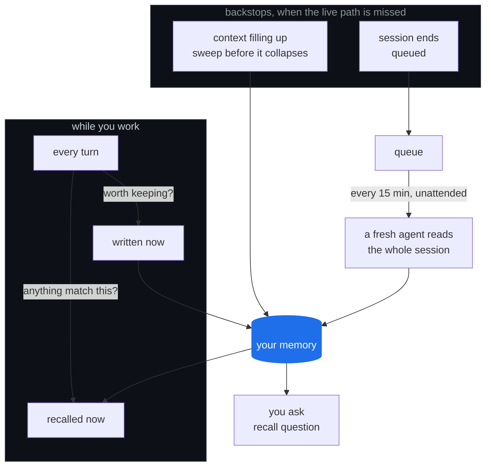

# okWOW • Recall

## Learn. Recall. Compound.

**Learn.** When a session ends, Recall works out what it actually taught — not what
happened, what was *learned*. The thing that finally worked. The decision, and what
it was chosen instead of. The approach that looked right and was abandoned, and why.

**Recall.** The next time that lesson matters, it is already in front of your agent.
Not filed somewhere searchable. In front of it, before anyone thinks to ask.

**Compound.** This is the one that matters. Every session starts further along than
the last one did. The work stops resetting and starts accumulating — which is the
only way a tool you use every day gets better instead of staying the same.

Your agent stops solving the same problem twice, and starts building on what it
already knows.

---

Everything stays on your machine. Your memory is a file on your disk — no account,
no telemetry, no server, nothing to sign up for.

One caveat, stated plainly because you would find it anyway: **working out what a
session taught is a model call.** Recall hands the finished session to whichever
agent you already use, which sends it to that provider exactly as your live session
did. That is the one place your work leaves the machine, and it is the same place it
was already going. If your memory lives in a git checkout, the worker commits and
pushes it — point it at a private repo, or at no repo.

## The shape of it

Three ways in. One memory. Two ways out.



**Capture is live, not a batch job at the end.** Every turn is a chance to write
something down and a chance to get something back. The two backstops exist
because the live path gets missed — a session that ends without capturing
anything is queued for an unattended pass, and a session about to lose its
context gets swept first.

That matters more than it sounds. A lesson captured at the moment it is learned
carries what it actually cost. The same lesson reconstructed from a transcript
three hours later carries a summary of it.

Recalling has two halves, and **you need both**. Most memory tools ship one.

**Push** is automatic and must be precise. It fires without being asked, so a false
positive costs more than a miss — a channel that cries wolf gets ignored, and then the one
hit that mattered is invisible too. So push only fires on something distinctive and
unmistakable — a client name, a file path, a policy number, an error message. Never on
an ordinary word that happens to appear.

**Pull** is what happens when someone asks. It can afford to be looser, because a person
is already looking. It searches the full text of everything, including the lessons push
can never reach.

Without pull, every lesson that is a *judgement* rather than a phrase — how this client
likes to be handled, why that approach was abandoned — gets written down perfectly and
never surfaces again. In the memory this came from that was **43% of everything
captured**, and nobody noticed for months. A memory that finds nothing looks exactly
like a week where nothing was learned.

## What it captures

Three kinds of thing, kept apart because they get recalled at different moments.

| | what lands here |
|---|---|
| **Failure modes** | Something broke and you found out why. The misleading error and its true cause. The config that only bites under load. The version that silently changed behaviour. |
| **Process failures** | Nothing was broken — the *approach* was wrong. Verified against the wrong case and called it done. Trusted a stale checkout. Shipped a claim nothing tested. |
| **Decisions** | What was chosen, what it was chosen **instead of**, and why. Reversals count double: "we did X, now we do Y, because Z" encodes the lesson twice. |

An entry is only worth keeping if it clears four bars: it helps a session that
is not this one, it took discovery rather than a glance at the docs, it names an
exact trigger and an exact fix, and the fix actually ran. Most sessions produce
nothing that clears all four, and that is the expected result.

What it will not keep: anything inferred from a single instance with no evidence,
a restatement of what the code already says, a decision with no rejected
alternative, and secrets of any kind — it records the path to a credential, never
the value.

## Install

```bash
git clone https://github.com/ok-wow/recall.git ~/recall && cd ~/recall && ./install.sh
```

The repo is private to the okWOW org, so you need org access on the GitHub
account your `git` is authenticated as.

If you would rather your agent did it, paste this — note that it points the agent
at the installer instead of describing the steps, so you still get the plan, the
backup, and a working `--uninstall`:

```
Clone https://github.com/ok-wow/recall into ~/recall and run ./install.sh.
Show me the plan it prints before you answer yes.
```

Works with **Claude Code** and **Codex**. The host is detected from whichever
config exists; `--host claude` or `--host codex` picks explicitly. The two take
the same hook structure in different files (`settings.json` vs `hooks.json`),
which is why one installer serves both.

`install.sh` registers the hooks with your agent, links the `/compound` skill into your
agent's skills directory, creates `~/.recall`, and schedules the drain. It prints
everything it is about to do and asks first.

The skill is the half that decides what gets written down. Without it the loop still
captures and drains, and then writes nothing — an empty memory is indistinguishable from
a quiet one, so it is linked at install time rather than left as a manual step.

Requires Python 3.9+, PyYAML, and an agent CLI that supports session hooks. CI runs
the suites on 3.9 through 3.13 on every push, so that floor is tested rather than
claimed — it went untested for months before anyone checked.

## Use

`install.sh` does not put anything on your `PATH` — it makes exactly one symlink,
and that is the skill. So the tool is called by path:

```bash
# ask your memory — plain language, no query syntax
python3 ~/recall/scripts/recall.py "how do we handle a renewal that slipped"

# one entry in full, with the triggers that make it fire
python3 ~/recall/scripts/recall.py --id the-q3-figures-live-in-the-finance-sheet

# what has repeated ANYWAY, despite being written down — the compounding scoreboard
python3 ~/recall/scripts/recall.py --recurring

# what has been learned, and how much of it can be recalled
python3 ~/recall/scripts/recall.py --stats
```

Worth one line in your shell profile if you use it by hand:

```bash
alias recall='python3 ~/recall/scripts/recall.py'
```

Everything else is automatic. Sessions get captured when they end, distilled on a schedule,
and matched against your prompts while you work.

## Configuration

Every path resolves through an environment variable with a default. No absolute paths.

| Variable | Default | Holds |
|---|---|---|
| `RECALL_HOME` | `~/.recall` | all mutable state |
| `RECALL_CATALOG_DIR` | `$RECALL_HOME/catalogs` | the YAML catalogs |
| `RECALL_AGENT_BIN` | `claude` | CLI used for unattended distillation |
| `RECALL_HOST_DIR` | `~/.claude` | your agent's dir (transcripts, settings) |

Those are the four you are likely to set. Another dozen `RECALL_*` variables tune
the drain's budgets, timeouts and paths; each is named and defaulted at the top of
the script that reads it. `--host codex` switches the last two defaults to
`~/.codex` and `codex`.

## What it deliberately does not do

- **No cloud, no telemetry, no account of its own.** Your memory is a local file.
  Distillation still goes to your model provider — see above; that is the one
  place your session content leaves the machine, and it is the same place it went
  when you were typing.
- **No embedding model.** BM25 over full text, pure stdlib. It has to run inside a hook,
  a cron job, and a fresh clone with nothing installed.
- **No content ships.** This repo is the mechanism. The catalogs start empty and fill with
  what your own work teaches it.

## Honest limitations

- **Recalling is not yet compounding.** Every measurement here proves the right lesson
  appeared. None proves it changed the outcome. 10% of lessons in the source memory
  recurred *anyway* — written down, and repeated regardless. That counter, not the
  number of times something surfaced, is the honest scoreboard.
- **Push cannot reach prose.** An entry whose triggers are conceptual rather than literal
  will never auto-inject. That is why `recall` exists and why the agent is told to run it.
- **Distillation costs tokens.** The drain spawns a headless agent per session. It is
  bounded by a wall-clock budget and a per-session timeout, and it is idle-cheap, but it
  is not free.
- **Quality depends on your sessions.** A memory built from sloppy work is a memory of
  sloppy lessons. It compounds whatever you actually do.

## Why the comments are long

Most guards in this codebase exist because something specific broke. The comment beside a
guard says which failure it prevents, because a guard whose reason is forgotten gets
removed by the next person who finds it inconvenient. If you are reading a condition that
looks paranoid, the comment tells you what happened.

A few that shaped the design:

- The drain measured "did this get done?" by whether the worker deleted its own marker.
  A worker that did the job correctly and declined the bookkeeping was recorded as failed,
  retried, and quarantined. 60 sessions went missing into a directory nothing counted.
  Progress is now derived from what the dispatcher observes — exit code, kill status.
- The oversize gate parked large transcripts in a tier with no consumer. Because transcript
  size tracks session length, it was collecting the *longest working sessions* — the best
  material in the queue. A gate must hand overflow to a reduced path, not a dead end.
- The test suite drove the real hook, which logged to the real signal log. 45% of the
  retrieval evidence was fixtures, and the published baseline was wrong in both directions.
  Every durable write path now takes an env override and the suite asserts it did not move.

## Tests

```bash
python3 -m tests.run    # or: for t in tests/test_*.py; do python3 "$t"; done
```

Eight suites. They assert behaviour that matters rather than coverage: that a correct no-op is
distinguishable from a failure, that housekeeping runs on the idle path, that a test cannot
write to production state, and that an entry written in prose is still retrievable.

One of them, `test_ships_what_it_invokes`, exists because an earlier cut of this repo
shipped every part of the loop except the skill the drain invokes, and five green suites
said nothing — the drain suite replaces the agent with a stub, so the stub stood exactly
where the missing piece belonged. It now checks statically that every slash command and
sibling script the shipped code names resolves inside the repo. Gate on the exit code,
not on a fixture total.

## License

MIT. See LICENSE.
