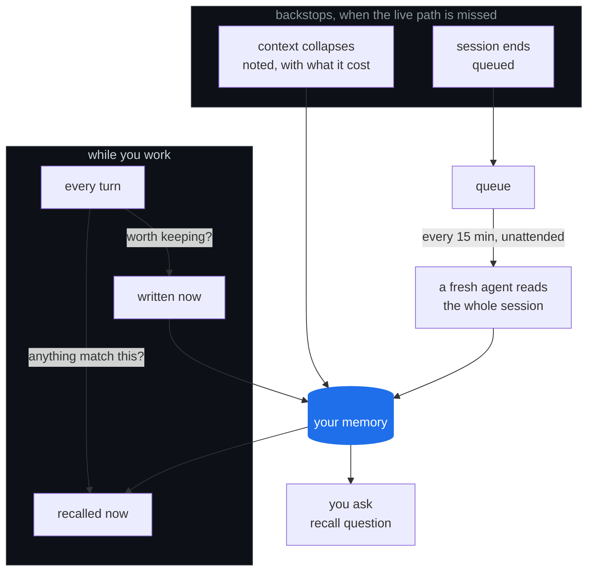

# okWOW • Recall

## Learn. Recall. Compound.

**Learn.** When a session ends, Recall works out what it actually taught — not what
happened, what was *learned*. The thing that finally worked. The decision, and what
it was chosen instead of. The approach that looked right and was abandoned, and why.

**Recall.** The next time that lesson matters, it is already in front of your agent.
Not filed somewhere searchable. In front of it, before anyone thinks to ask.

**Compound.** This is the one that matters. Every session starts further along than
the last one did. The work stops resetting and starts accumulating — which is the
only way a tool you use every day gets better instead of staying the same.

Your agent stops solving the same problem twice, and starts building on what it
already knows.

---

Everything stays on your machine. Your memory is a file on your disk — no account,
no telemetry, no server, nothing to sign up for.

**Working out what a session taught is a model call.** Recall hands the finished
session to the agent you already use, so it goes exactly where your live session was
already going — and nowhere new. Your memory itself never travels: it is a file on
your disk. Keep it in a git checkout and the worker commits there, so a private repo
or no repo at all is entirely your call.

## The shape of it

Three ways in. One memory. Two ways out.



**Capture is live, not a batch job at the end.** Every turn is a chance to write
something down and a chance to get something back. The backstops exist because
the live path gets missed: a session that ends without capturing anything is
queued for an unattended pass.

The second backstop only watches, and deliberately. When a context window
collapses, Recall records how big your memory was at that moment and tells you
at the next session start if it never grew — the window closed and nothing was
written down. It cannot intervene: a hook is a shell command, there is no agent
mid-thought to instruct, and blocking a compaction on a full context strands the
session with no way forward. So it counts instead, because nothing else counts
this, and you cannot tell whether a backstop is load-bearing until you know how
often it was bypassed. (Claude Code only — Codex has no such event.)

That matters more than it sounds. A lesson captured at the moment it is learned
carries what it actually cost. The same lesson reconstructed from a transcript
three hours later carries a summary of it.

Recalling has two halves, and **you need both**. Most memory tools ship one.

**Push** is automatic and must be precise. It fires without being asked, so a false
positive costs more than a miss — a channel that cries wolf gets ignored, and then the one
hit that mattered is invisible too. So push only fires on something distinctive and
unmistakable — a client name, a file path, a policy number, an error message. Never on
an ordinary word that happens to appear.

**Pull** is what happens when someone asks. It can afford to be looser, because a person
is already looking. It searches the full text of everything, including the lessons push
can never reach.

This is the half most memory tools leave out, and it is the half that carries your
judgement calls — how this client likes to be handled, why that approach was abandoned.
Those never contain a literal to match on, so push alone would file them perfectly and
never show them again. In the memory Recall came from, they were **43% of everything
captured**. Pull is how you get that 43% back.

## What it captures

Three kinds of thing, kept apart because they get recalled at different moments.

| | what lands here |
|---|---|
| **Failure modes** | Something broke and you found out why. The misleading error and its true cause. The config that only bites under load. The version that silently changed behaviour. |
| **Process failures** | Nothing was broken — the *approach* was wrong. Verified against the wrong case and called it done. Trusted a stale checkout. Shipped a claim nothing tested. |
| **Decisions** | What was chosen, what it was chosen **instead of**, and why. Reversals count double: "we did X, now we do Y, because Z" encodes the lesson twice. |

An entry is only worth keeping if it clears four bars: it helps a session that
is not this one, it took discovery rather than a glance at the docs, it names an
exact trigger and an exact fix, and the fix actually ran. Most sessions produce
nothing that clears all four, and that is the expected result.

What it will not keep: anything inferred from a single instance with no evidence,
a restatement of what the code already says, a decision with no rejected
alternative, and secrets of any kind — it records the path to a credential, never
the value.

## Install

```bash
git clone https://github.com/ok-wow/recall.git ~/recall && cd ~/recall && ./install.sh
```

The repo is private to the okWOW org, so you need org access on the GitHub
account your `git` is authenticated as.

If you would rather your agent did it, paste this — note that it points the agent
at the installer instead of describing the steps, so you still get the plan, the
backup, and a working `--uninstall`:

```
Clone https://github.com/ok-wow/recall into ~/recall and run ./install.sh.
Show me the plan it prints before you answer yes.
```

Works with **Claude Code** and **Codex**. The host is detected from whichever
config exists; `--host claude` or `--host codex` picks explicitly. The two take
the same hook structure in different files (`settings.json` vs `hooks.json`),
which is why one installer serves both.

`install.sh` registers the hooks with your agent, links the `/compound` skill into your
agent's skills directory, creates `~/.recall`, and schedules the drain. It prints
everything it is about to do and asks first.

The skill is the half that decides what gets written down. Without it the loop still
captures and drains, and then writes nothing — an empty memory is indistinguishable from
a quiet one, so it is linked at install time rather than left as a manual step.

Requires Python 3.9+, PyYAML, and an agent CLI that supports session hooks. CI runs
the suites on 3.9 through 3.13 on every push, so that floor is tested rather than
claimed — it went untested for months before anyone checked.

## Use

`install.sh` does not put anything on your `PATH` — it makes exactly one symlink,
and that is the skill. So the tool is called by path:

```bash
# ask your memory — plain language, no query syntax
python3 ~/recall/scripts/recall.py "how do we handle a renewal that slipped"

# one entry in full, with the triggers that make it fire
python3 ~/recall/scripts/recall.py --id the-q3-figures-live-in-the-finance-sheet

# what has repeated ANYWAY, despite being written down
python3 ~/recall/scripts/recall.py --recurring

# what auto-injection can never fire on — push's blind spot, entry by entry
python3 ~/recall/scripts/recall.py --unreachable

# ...and the blind spot INSIDE an entry: a correction filed into a recurrence
# note, which no channel prints, so nobody is ever shown it
python3 ~/recall/scripts/recall.py --hidden

# ...and whether those repeats were ever SHOWN first — the honest scoreboard
python3 ~/recall/scripts/measure_prevention.py
python3 ~/recall/scripts/measure_prevention.py --gaps   # lessons that never surfaced

# what has been learned, and how much of it can be recalled
python3 ~/recall/scripts/recall.py --stats

# would retrieval have found it? replay decisions you already made
python3 ~/recall/scripts/replay.py

# ask again, and let a judgment model put the best answer first
python3 ~/recall/scripts/recall.py --rerank "an approval that came from a bot"
```

### `replay.py` — measure the retriever against your own history

Every claim about retrieval needs ground truth, and labelling it is why most
retrievers are never measured. Your transcripts already hold some: **every time
a session loaded a skill, it decided which procedure that moment called for.**
Replay the moment and see where the retriever puts that skill. Nobody labels
anything, and it works before you have a corpus at all.

```
90 skills · 160 transcripts holding a skill call · 537 invocations
  0 had no typed prompt before them · 56 used a skill outside this library

NAMED by the person  (a control — it proves nothing)   n=142
  hit@1  38.7%   hit@3  59.9%   hit@5  76.1%   hit@10  80.3%

CHOSEN by the model  (the measurement)   n=339
  hit@1  15.0%   hit@3  32.2%   hit@5  38.1%   hit@10  48.1%
  MRR   0.269     never retrieved at all: 72
```

**The split is the whole point.** Two invocations look identical in a transcript
and mean opposite things. If the person typed the skill's name, nothing was
discovered and a retriever scores well by reading the name back. Only the moments
the model chose unprompted measure anything, and reporting them together flatters
the retriever — which is why they are never reported together here.

`--judge` ranks the same moments with the judgment model instead, so the two are
comparable on identical ground. On 63 of those moments here:

| | hit@1 | hit@3 | hit@10 | MRR | never retrieved |
|---|---|---|---|---|---|
| search | 15.9% | 41.3% | 60.3% | 0.311 | **11 of 63** |
| judge | **27.0%** | 47.6% | **71.4%** | 0.401 | **0** |

The judge ranked it higher on 35 moments, search on 13, and they tied on 15.

The last column is the finding. Search never surfaced the right skill *at all*
for 11 of 63 moments, so no amount of reranking its output could have helped —
**the ceiling here is which candidates get considered, not how they are ordered.**
With only ninety skills, every one fits in a single request, so there is no
retrieval stage to be the bottleneck. That is the opposite of the corpus, where
1,686 entries force a search stage and the right answer is usually present and
merely mis-ranked. Which stage limits you has to be measured per channel.

Two caveats on those numbers: 17 of 80 sampled moments were lost to provider
`503`s, which is load rather than anything about the moments, and this subsample
is a little kinder to search at depth than the full set (hit@10 60.3% here
against 48.1% over all 339).

`--misses` lists what search put outside the top three, worst first; that list is
usually a better argument for rewriting a description than any opinion about it.

What it cannot tell you: that a session chose a skill does not make it the right
skill. A miss can be the retriever failing or the original choice being poor, and
this cannot separate them. Read it as a comparison between retrievers, not as a
score for either.

### `--rerank` — when search order is the wrong order

Search finds; it does not judge. Measured over one session's 26 real queries
(2026-09-21): the top result scored **0.56** mean relevance, while **65%** of
those queries already held a clearly relevant lesson somewhere in the top three.
The answer was usually present and sitting under something worse.

`--rerank` sends the top ten candidates to a judgment model in one call and
reorders them by how well each actually answers the question. It is **off unless
you ask for it**, needs `AI_GATEWAY_API_KEY`, and costs about a second.

```
an-approved-reviewdecision-can-be-a-bot-not-a-person  ×2
  [FM]  judged 0.94  score 32.0  matched: approved, bot, person, pull, request
```

Both numbers are printed because they answer different questions: `score` says
why the entry was fetched at all, `judged` says why it is in this position.

Three deliberate limits:

- **It never fails your query.** No key, a timeout, a busy gateway — you get a
  note on stderr and the ordinary search order. A rougher ranking beats no answer.
- **It applies no threshold.** The ordering is the trustworthy part; the absolute
  numbers are not calibrated, and the same lessons under a differently worded
  prompt have been measured moving a score from 0.96 to 0.72. Nothing is dropped
  for scoring low.
- **It judges more than it shows.** Ten candidates for five results, because in
  the measurement the lesson that mattered most for one situation sat at search
  rank nine.

Set `RECALL_RERANK=1` to turn it on for a whole session without passing the flag.

#### Getting a key

The judge is `typesafe-ai/jev`, one of the models in Vercel's AI Gateway catalogue.
There is nothing special to sign up for — an ordinary AI Gateway key reaches it.

From the [AI Gateway API Keys page](https://vercel.com/d?to=%2F%5Bteam%5D%2F%7E%2Fai-gateway%2Fapi-keys):
**Create key**, name it, and copy the value. You cannot retrieve it again. It
starts with `vck_`.

Or from the terminal, with the [Vercel CLI](https://vercel.com/docs/cli):

```bash
vercel ai-gateway api-keys create --name recall-rerank
```

Then put it in your environment — `AI_GATEWAY_API_KEY` is Vercel's own name for
it, so anything else you run through the gateway will find the same variable:

```bash
export AI_GATEWAY_API_KEY=vck_...
```

**Give the key a budget.** You can cap spend per key when you create it, and this
is a tool you may leave switched on with `RECALL_RERANK=1`. A budgeted key fails
closed — and because a failed judge falls back to search order, a key that hits
its cap makes `--rerank` quietly stop reranking rather than break your retrieval.

The dashboard and CLI steps above are Vercel's, from their API-keys docs. What
this project verified is the part that touches `recall`: that `typesafe-ai/jev`
is in the gateway's public model list and answers an ordinary `vck_` key, and
that an unset variable prints the line above and returns search order.

Two more things from Vercel's docs, worth knowing before you leave a key lying
around:

- A key is tied to the person who created it. If they leave the team, Vercel
  deactivates it. For something long-lived, create it as a team-attributed key.
- If a key leaks, you can revoke it without being signed in, by reporting it to
  `https://api.vercel.com/external/compromised_secret`.

Recall reads the key from the environment, sends it as a bearer token, and never
writes it anywhere — not to the retrieval log, not to an error message, not to
disk. If the variable is unset, `--rerank` says so on stderr and gives you the
ordinary search order.

The gateway's own dashboard shows what each request cost. The API response does
not carry a cost field, only token counts, so `recall` cannot tell you the price
itself.

Worth one line in your shell profile if you use it by hand:

```bash
alias recall='python3 ~/recall/scripts/recall.py'
```

Everything else is automatic. Sessions get captured when they end, distilled on a schedule,
and matched against your prompts while you work.

## Configuration

Every path resolves through an environment variable with a default. No absolute paths.

| Variable | Default | Holds |
|---|---|---|
| `RECALL_HOME` | `~/.recall` | all mutable state |
| `RECALL_CATALOG_DIR` | `$RECALL_HOME/catalogs` | the YAML catalogs |
| `RECALL_RERANK` | unset (off) | `1` turns `--rerank` on for every query |
| `RECALL_RERANK_POOL` | `10` | candidates sent to the judge per query |
| `RECALL_JEV_URL` | the Vercel AI Gateway | where the judge lives |
| `RECALL_JEV_TIMEOUT` | `20` | seconds before the judge is given up on |
| `RECALL_AGENT_BIN` | `claude` | CLI used for unattended distillation |
| `RECALL_HOST_DIR` | `~/.claude` | your agent's dir (transcripts, settings) |
| `RECALL_TRANSCRIPTS_DIR` | `$RECALL_HOST_DIR/projects` | history `replay.py` reads |
| `RECALL_SKILLS_DIR` | `$RECALL_HOST_DIR/skills` | the candidate set `replay.py` ranks |

The first two are the ones you are likely to set. Another dozen `RECALL_*` variables tune
the drain's budgets, timeouts and paths; each is named and defaulted at the top of
the script that reads it. `--host codex` switches the last two defaults to
`~/.codex` and `codex`.

## Deliberately small

- **Nothing to sign up for.** No cloud, no telemetry, no account, no dashboard. Your
  memory is a file you own, on a disk you control. Distillation goes to your model
  provider and nowhere else — the same place your typing already went.
- **Nothing to provision.** BM25 over full text, pure stdlib. It runs inside a hook, a
  cron job, and a fresh clone with nothing installed, because those are the only places
  it ever needs to run.
- **Nothing borrowed.** The catalogs start empty. What fills them is your work and only
  your work, so the memory reads in your vocabulary from the first entry on.

## It measures itself

Most memory tools can tell you how often they fired. Recall can tell you whether it
*mattered*, which is a harder and much more useful question.

```bash
python3 ~/recall/scripts/measure_prevention.py
```

When a lesson you captured comes true again, there are only two explanations, and they
call for opposite responses:

| | what it means | what to do |
|---|---|---|
| **Shown, then repeated** | The lesson reached you and did not change the outcome. | Rewrite it, retime it, or enforce it. More retrieval will not help. |
| **Never shown** | The lesson was sitting there and never surfaced. | Retrieval is exactly the fix — a better trigger, or an agent told to ask. |

Reported as a single "how often did it repeat" number, those two are indistinguishable
and the number cannot guide anything. Split apart, it becomes a work queue. On the
memory Recall was extracted from, **23 of 28 measurable repeats had never surfaced at
all** — so most of what looked like a memory problem was a delivery problem, and
delivery is the fixable kind.

The tool is equally clear about what it cannot see. A recurrence written as a bare
counter has no date, so it cannot be placed against the moment a lesson fired, and it
prints that bucket as loudly as the measured ones. Recall gates the recording rule at
commit time to keep that bucket shrinking.

**What no version of this proves is causation.** A lesson that appeared, followed by a
failure that did not repeat, is encouraging rather than conclusive — the situation may
simply not have come back. Settling it would take a holdout arm, and Recall does not
run one. It tells you what it knows, marks the edge of that, and leaves the inference
to you.

## Worth knowing before you install

- **Push reaches literals; pull reaches everything.** An entry whose triggers are
  conceptual rather than literal will not auto-inject, which is precisely why `recall`
  exists and why your agent is told to run it.
- **Distillation costs tokens.** A headless agent per session, bounded by a wall-clock
  budget and a per-session timeout, and idle-cheap — but real.
- **It compounds whatever you actually do.** A memory built from careful work is a
  memory of careful lessons. The reverse is also true.

## Every guard carries its receipt

Read any condition in this codebase that looks paranoid and the comment beside it will
tell you which specific failure it prevents. That is deliberate: a guard whose reason has
been forgotten gets deleted by the next person who finds it inconvenient, so the reason
lives next to the code rather than in someone's memory.

Three that shaped the design:

- **Progress is now a fact the system observes, not a favour the worker does.** The drain
  once measured "did this get done?" by whether the worker deleted its own marker — so a
  worker that did the job and skipped the bookkeeping was recorded as failed, retried, and
  quarantined. Exit code and kill status replaced it.
- **A gate hands overflow to a reduced path, never a dead end.** The oversize gate parked
  large transcripts in a tier with no consumer. Transcript size tracks session length, so
  it was quietly collecting the longest working sessions — the best material in the queue.
- **Every durable write path takes an env override, and the suite asserts it.** The tests
  once drove the real hook into the real signal log, which made 45% of the published
  retrieval evidence its own fixtures.

## Tests

```bash
python3 -m tests.run    # or: for t in tests/test_*.py; do python3 "$t"; done
```

Ten suites, written to assert behaviour rather than chase coverage: that a correct
no-op stays distinguishable from a failure, that housekeeping still runs on the idle
path, that a test cannot reach production state, and that an entry written in plain
prose is still retrievable.

Two are worth reading if you want the shape of the project.

`test_measure_prevention` guards a **conclusion** rather than a crash. If a fire logged
*after* a repeat were ever counted as having preceded it, every delivery failure would
be relabelled a heeding failure and the tool would send you off to rewrite entries
nobody was ever shown — with nothing appearing broken. So the ordering is asserted
directly, and fixture rows are proven never to count as real delivery.

`test_ships_what_it_invokes` checks statically that every slash command and sibling
script the shipped code names actually resolves inside the repo. An earlier cut shipped
the whole loop except the skill the drain invokes, and five green suites said nothing,
because the drain suite replaces the agent with a stub — and the stub stood exactly
where the missing piece belonged.

Each suite carries negative controls, so a check that has quietly stopped checking
anything fails loudly. Gate on the exit code, not on a fixture total.

## License

MIT. See LICENSE.
